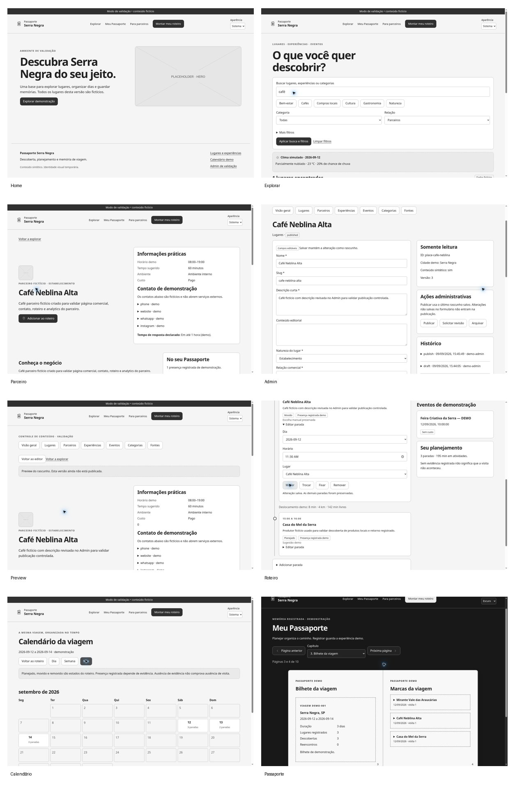

# Passaporte Serra Negra: repositório de validação

> **Estado:** vertical slice funcional para validação incremental. Dados, parceiros, clima, visitas e conteúdo são fictícios. Não é MVP final nem aprovação de produção.

## Revisão no GitHub

Este pacote foi preparado para ser revisado diretamente no GitHub. A forma mais rápida é ler o [relatório de validação](VALIDATION_REPORT.md), abrir o [guia de revisão](docs/GITHUB_VALIDATION_GUIDE.md) e usar GitHub Codespaces para navegar pela aplicação. O workflow `Validation` também pode ser executado manualmente em Actions e usa PostGIS + Playwright.

**Gates atuais:** G0 = PASS; G1–G8 = PARCIAL. Não interpretar build verde como aprovação integral dos fluxos.



### Escopo já construído

| Área | Rota principal | Estado de implementação |
|---|---|---|
| Home | `/` | Implementada |
| Explorar | `/explorar` | Implementada |
| Lugar | `/lugares/[slug]` | Implementada |
| Parceiro | `/parceiros/[slug]` | Implementada |
| Admin | `/admin` | Implementada, regressão completa pendente |
| Onboarding | `/roteiro` | Implementado |
| Roteiro da viagem | `/viagens/demo-trip-001/roteiro` | Implementado |
| Calendário | `/viagens/demo-trip-001/calendario` | Implementado |
| Meu Passaporte | `/meu-passaporte` | Implementado |
| Health | `/health` | Implementado |

### Checkpoint atual: Bloco 08 PARCIAL

A baseline foi reexecutada no Bloco 08: `npm ci`, lint, TypeScript strict, 13 testes unitários, persistência PGlite, build, migrations/seed e smoke HTTP de nove rotas foram registrados como PASS. A suíte Playwright tentou os 51 casos, mas todos falharam antes do corpo dos testes porque o Chromium não pôde ser instalado naquele ambiente. PostgreSQL/PostGIS, Axe e novas screenshots responsivas continuam pendentes. Consulte `docs/validation/BLOCK-08.md` e `VALIDATION_REPORT.md` antes de alterar qualquer gate.

---

## Executar

Requisitos: Node 24, npm e Docker Compose.

```sh
npm ci
cp .env.example .env.local
docker compose up -d
npm run db:migrate
npm run db:seed
npm run dev
```

Abra http://localhost:4173. `/health` verifica a conexão. Os scripts de banco usam DATABASE_URL do ambiente ou a URL local demo padrão descrita em .env.example. Seeds preservam conteúdo existente por ID e não duplicam registros.

No Admin, use **Entrar no Admin demo**. Este login assume um administrador fictício, sem credenciais reais. Não é autenticação de produção. Salvar cria rascunho; Preview mostra o último rascunho salvo; Publicar atualiza o conteúdo público; Histórico mantém antes/depois. Publicação não inclui alterações ainda não salvas.

## Fallback explícito sem Docker

Para validar fluxos sem serviço externo, há PGlite (PostgreSQL embarcado, sem PostGIS). Defina DB_MODE=pglite e ALLOW_DEMO=true em `.env.local`.

Com a aplicação parada:

```sh
DB_MODE=pglite npm run db:migrate
DB_MODE=pglite npm run db:seed
npm run dev
```

Em PowerShell, defina `$env:DB_MODE="pglite"` antes dos comandos de migração e seed. PGlite é single-process: não abra o mesmo `.data/pglite` em processos simultâneos. O caminho padrão é descartável e ignorado pelo Git. Nunca execute seed/migration sobre ele com o servidor ativo.

## Verificar

```sh
npm run lint
npm run typecheck
npm test
ALLOW_DEMO=true npm run build
npx playwright install chromium
npm run test:e2e
```

Playwright inclui desktop 1440×1000, tablet 1024×768 e mobile 390×844 com reduced motion. CI instala dependências pelo lockfile, usa PostGIS e executa verificações e suíte E2E. Workflow entregue não significa execução remota confirmada.

## Arquitetura e limites

Monólito modular em `src/modules`. Drizzle concentra a persistência. Conteúdo versionado separa `draft` e `published`; o público não recebe o rascunho. Cookie mock assinado protege o Admin no servidor; mutações e auditoria são transacionais, com comparação de versão.

Providers de autenticação, mapa, rotas, clima, armazenamento e analytics são substituíveis. Adapters demo são determinísticos. Produção exige ALLOW_DEMO=true explicitamente; adapters reais ainda não estão implementados. A página pública impede abrir contatos example.invalid como reais.

Icon System v2 é fornecido pelo kit e mantido em `src/design-system` e `public/icons`. Não há ícones de outras bibliotecas. Fontes e cores são temporárias, marcadas VALIDATION_ONLY. Claro/Escuro/Sistema usam tokens. O helper de i18n oferece pt-BR e chaves para en/es; extração completa e traduções ainda são pendências.

O schema é v0 de validação, com JSONB tipado e relações validadas pela aplicação. Não é o Data Model definitivo. Consulte `docs/decisions/` e `docs/validation/`.

## Fora do escopo e pendências

Não inclui identidade visual final, fotografias reais, mapa territorial oficial, motor oficial de carimbos, QR antifraude, reservas, pagamentos, Travel Engine definitivo, analytics avançado, integrações com credenciais ou conclusões jurídicas. Screenshots disponíveis ficam em `artifacts/playwright/`.

O Bloco 08 continuou sem Docker/PostGIS e sem um Chromium Playwright instalável no ambiente que produziu o checkpoint. A checagem visual histórica disponível permanece a do navegador cloud do Bloco 07. Consulte `docs/validation/BLOCK-08.md` e ADR-004 para distinguir verificações executadas de testes apenas preparados.

## Entrega e continuidade

Os blocos 00–06 estão implementados e o Bloco 08 é o checkpoint de regressão atual, ainda PARCIAL. `WORK_STATE.md`, `docs/validation/BLOCK-08.md` e `VALIDATION_REPORT.md` descrevem decisões, limites e próximos passos. O PASS de integridade dos ZIPs não significa aprovação integral dos gates.

Para verificar persistência sem afetar o banco de trabalho:

```sh
node --import tsx scripts/verify-persistence.ts
```

O script cria banco PGlite temporário, repete migração e seed, confere contagens e preservação de edição e remove somente o banco criado por ele. Não valida PostGIS.

Para build separado da prévia ativa, use `NEXT_BUILD_DIR=.next-build ALLOW_DEMO=true npm run build`; se quiser executar esse build, mantenha `NEXT_BUILD_DIR=.next-build` também em `npm start`. O comando padrão continua usando `.next`.

`LATEST.zip` é o projeto completo sem caches, dependências ou banco binário. Após extrair, siga os comandos de instalação/seed acima. ZIP individual contém apenas arquivos do bloco e deve ser aplicado sobre o snapshot anterior. Não restaura as mutações transitórias feitas durante QA. Os relatórios e screenshots preservam a evidência desses fluxos.

A execução anterior registrou commits por bloco, mas o `.git` não fazia parte do snapshot recebido. Este pacote inicia um histórico novo a partir do estado consolidado, sem inventar commits antigos. Para publicar, adicione o remote autorizado e faça push de `main`. Nunca inclua `.env.local` ou diretórios de banco.
