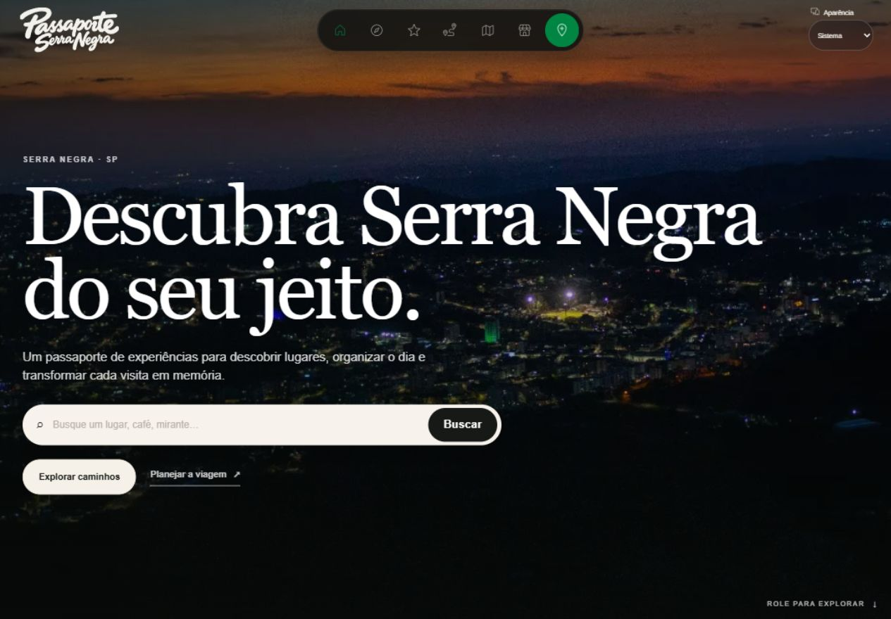
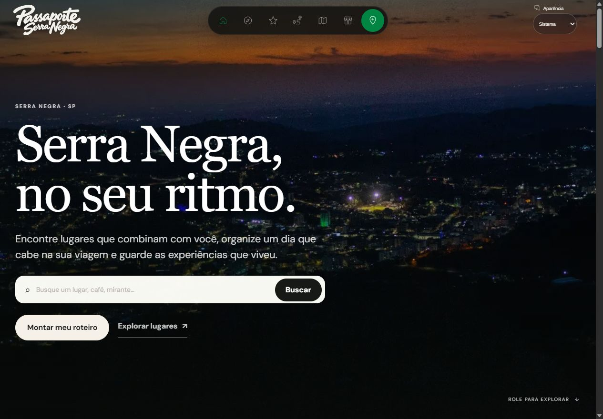
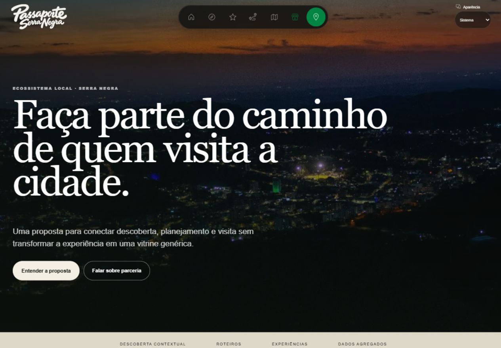
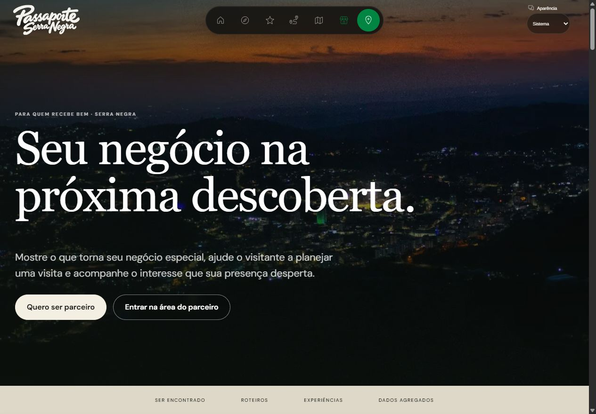
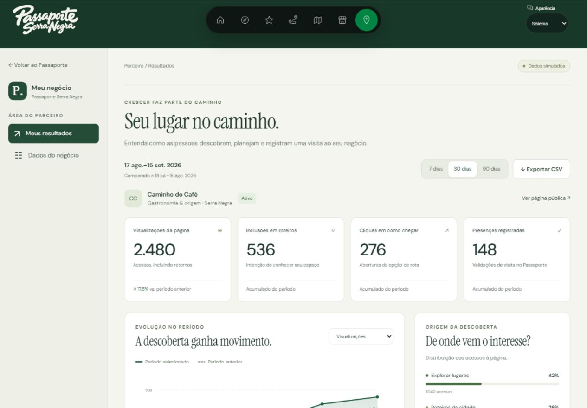
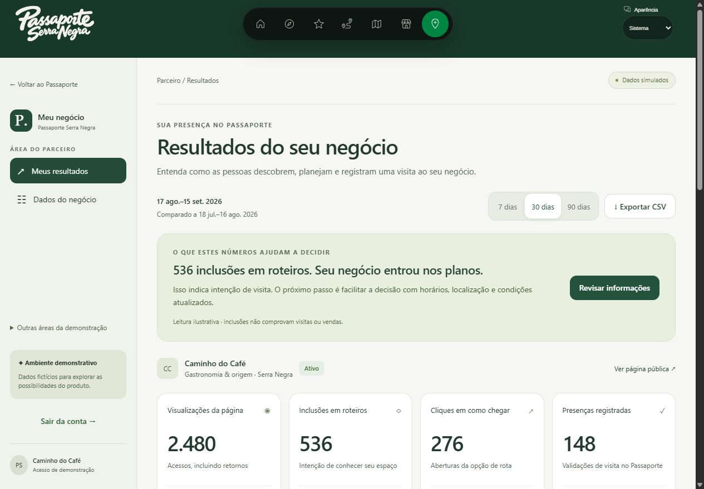

# Duas narrativas, duas decisões

## Diagnóstico Advisor

A revisão seguiu o arquivo MODO_ADVISOR.md fornecido: diagnosticar, priorizar e ligar informação a uma ação. A hipótese principal é que a proposta precisava demonstrar sua utilidade mais cedo. Não há dados de conversão que permitam afirmar aumento de resultados.

## 1. Turista — aproveitar a cidade no próprio ritmo

**Mensagem central: Serra Negra, no seu ritmo.**

Você chega com vontade de conhecer, mas ainda precisa escolher os lugares e organizar o tempo. O Passaporte ajuda a descobrir o que combina com você, começar por um roteiro e guardar os registros das experiências vividas.

A sequência agora é **descobrir → planejar → viver e registrar**. Os textos apresentam o benefício antes de explicar o funcionamento. Os atalhos locais acompanham esses momentos. Seções repetidas foram reduzidas e os interesses ficaram junto à descoberta de lugares.

**Decisão prioritária:** mostrar roteiros prontos antes de pedir respostas. Durante a conferência, o planejador personalizado abriu um formulário de oito etapas. A chamada principal passou a ser “Ver roteiros prontos”; o planejamento personalizado continua disponível na navegação.

## 2. Parceiro — ser encontrado e facilitar a visita

**Mensagem central: Seu negócio na próxima descoberta.**

Seu negócio tem uma experiência para oferecer. Uma apresentação clara desperta interesse; horários, localização e condições ajudam o visitante a decidir. O parceiro pode acompanhar os sinais dessa jornada e escolher o que melhorar.

A sequência é **apresentar a experiência → facilitar a decisão de visita → acompanhar o interesse → agir**. A página comercial tem chamadas distintas para quem deseja participar e para quem já quer entrar no painel.

No painel, os títulos passaram a identificar tarefas. As inclusões em roteiros vêm acompanhadas de interpretação e de um próximo passo: revisar informações do negócio. A demonstração distingue intenção, presença registrada e venda; não atribui receita aos cliques.

## Design e navegação

Os princípios de clareza, legibilidade, organização dos controles e áreas de toque foram adaptados do [guia da Apple](https://developer.apple.com/design/tips/). Isso não constitui certificação de conformidade com as Human Interface Guidelines.

- Header original preservado.
- Navegação contextual com indicação da etapa e transferência de foco ao destino.
- Controles principais com altura mínima de 44 px, adaptação web da orientação de toque da Apple.
- Textos maiores nos painéis, hierarquia mais clara e espaçamento consistente.
- Troca entre áreas recolhida em um controle secundário.
- Movimento reduzido respeitado.

## Conferência das telas

1. **Turista — revisado e funcional:** capa, etapas, abas por teclado e acesso aos roteiros prontos conferidos. Um conflito na navegação estática dos roteiros foi corrigido.
2. **Parceiro — revisado e funcional:** proposta, abertura do formulário demonstrativo e entrada na área do parceiro conferidas.
3. **Painel do parceiro — revisado e funcional:** mudança de período atualiza a leitura dos dados; a ação “Revisar informações” abre o cadastro. Versões móveis foram inspecionadas.

### Evidências antes e depois

Turista, antes:

Turista, depois (registro anterior ao ajuste final do botão para “Ver roteiros prontos”):

Parceiro, antes:

Parceiro, depois:

Painel, antes:

Painel, depois:

## Validação e próximo aprendizado

A compilação de produção, TypeScript e análise dos arquivos alterados passaram. As interações descritas foram conferidas com Playwright no navegador integrado. Não foi executada uma auditoria completa de acessibilidade nem a suíte integral de testes. Dados e acessos permanecem simulados.

Antes de investir em aquisição, a próxima validação recomendada é observar turistas tentando escolher um roteiro e parceiros interpretando o painel. Verificar se entendem a proposta, encontram a primeira ação e conseguem explicar o que fariam com os indicadores. Essa pesquisa ainda não foi realizada.

## Ajuste de 21/09 — header e responsividade

As barras contextuais adicionadas anteriormente foram removidas das três páginas públicas. Permanece somente o header original. As capas do turista e do parceiro agora centralizam títulos, descrições, busca e ações, com altura flexível para telas baixas.

Verificação com Playwright: 320×740, 390×844, 768×1024, 1280×900, 1440×900 e 844×390. Nas duas páginas, não foram encontrados títulos ou controles escapando horizontalmente; os elementos das capas mantiveram alinhamento central. Em telas estreitas, os botões se distribuem em linhas e a busca se ajusta ao espaço disponível.

As imagens anteriores documentam a versão anterior; os registros atuais são `avaliacao/advisor-centralizado-turista.png` e `avaliacao/advisor-centralizado-parceiro.png`.
